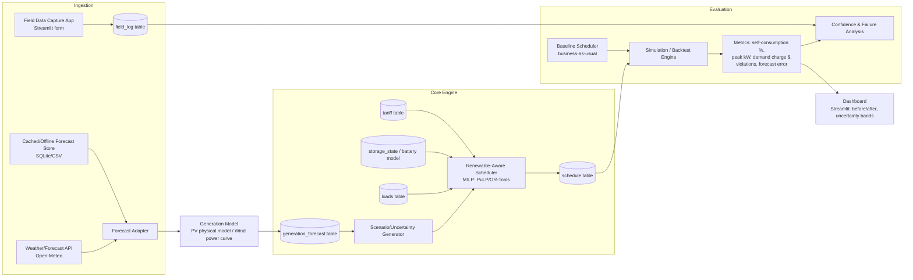

# ⚡ Renewable-Aware Industrial Load Scheduler

[](https://www.python.org/)
[](https://opensource.org/licenses/MIT)
[](https://github.com/coin-or/pulp)

A production-grade, renewable-aware industrial load scheduler that shifts flexible factory loads and co-optimizes Battery Energy Storage Systems (BESS) with forecasted solar and wind generation. Designed to minimize electricity **demand charges** (₹/kW) and Time-of-Use energy costs (₹/kWh) while enforcing **100% hard constraint non-negotiability** on process deadlines and HVAC comfort boundaries.

---

## 🌟 Key Features

- **MILP Co-Optimization Engine**: Formulated using PuLP / CBC Mixed-Integer Linear Programming to schedule flexible loads and battery charge/discharge on a rolling horizon.
- **Hierarchical Weather & Generation Forecast Adapter**: Integrates free Open-Meteo solar & wind APIs with automatic 3-stage fallback (`live_api` -> SQLite `cache` -> `climatology_fallback`) for 100% offline reliability.
- **Physical Solar & Wind Models**: Physical PV temperature derating model ($T_{cell}$) and cubic wind power-curve conversion.
- **Decoupled Backtest Engine**: Evaluates schedules defensively against ground-truth held-out generation actuals.
- **Interactive Results Dashboard**: Built with Streamlit & Plotly featuring P10–P90 forecast uncertainty bands, power dispatch graphs, and baseline vs optimizer vs oracle comparison matrices.
- **Mobile-Friendly Field Event Logger**: Low-bandwidth offline Streamlit app for plant engineers to log manual overrides and complaints directly into local SQLite `field_log`.
- **Zero Paid Dependencies**: Runs entirely on open-source Python libraries with zero commercial API keys required.

---

## 🏗 System Architecture



---

## 🚀 Quickstart & One-Command Run

### 1. Installation
Clone the repository and install dependencies:
```bash
cd /Users/akashbaskaran/.gemini/antigravity-ide/scratch/renewable_load_scheduler
pip install -r requirements.txt
```

### 2. Run Complete End-to-End Benchmark
Run the single orchestrator command to generate data, run baseline, optimizer, oracle schedules, backtest, and print full comparison metrics:
```bash
python run_all.py
```

### 3. Launch Interactive Results Dashboard
```bash
streamlit run app/dashboard.py
```

### 4. Launch Field Event Logger
```bash
streamlit run app/field_capture.py
```

---

## 🧪 Automated Test Suite

Run the full pytest suite (10 automated unit and edge-case tests):
```bash
python -m pytest tests/
```

### Included Edge/Failure Case Scenarios:
1. `test_edge_case_1_cloud_cover_surprise`: Handles unexpected 90% PV generation drop via grid/BESS fallback without deadline misses.
2. `test_edge_case_2_wind_lull`: Manages sudden wind speed drop below cut-in threshold.
3. `test_edge_case_3_deadline_conflict_low_renewables`: Satisfies overlapping deadlines under zero renewable generation.
4. `test_edge_case_4_battery_degraded_unavailable`: Graceful degradation when battery storage system is offline.
5. `test_edge_case_5_offline_climatology_fallback`: Operates seamlessly when weather API is unreachable using climatology persistence model.

---

## 📁 Repository Structure

```
renewable_load_scheduler/
├── README.md                          # Project overview and quickstart
├── USER_GUIDE.md                      # Operator manual & scenario setup guide
├── run_all.py                         # Single-command end-to-end benchmark runner
├── requirements.txt                   # Dependency manifest
├── schema.sql                         # SQLite schema definitions
├── db.py                              # SQLite database helper module
├── data_generator.py                  # Synthetic weather & generation data generator
├── config/
│   └── scenario.yaml                  # Facility profile, loads, BESS, tariff config
├── forecast/
│   ├── adapter.py                     # Open-Meteo API adapter with offline fallbacks
│   ├── generation_model.py            # Physical PV & Wind power curve models
│   └── uncertainty.py                 # P10/P50/P90 confidence interval generator
├── scheduler/
│   ├── baseline.py                    # Naive business-as-usual fixed scheduler
│   └── optimizer.py                   # MILP PuLP/CBC load & BESS co-optimizer
├── sim/
│   ├── backtest_engine.py             # Simulation engine evaluating schedules against ground truth
│   └── metrics.py                     # KPI calculations & hard constraint validators
├── app/
│   ├── dashboard.py                   # Streamlit interactive visual dashboard
│   └── field_capture.py               # Mobile-friendly offline field event logger
├── tests/
│   ├── test_forecast.py               # Weather & physical model tests
│   ├── test_baseline.py               # Baseline scheduler tests
│   ├── test_optimizer.py              # MILP vs Baseline vs Oracle comparative tests
│   └── test_edge_cases.py             # 5 Edge/failure case scenario tests
└── docs/
    ├── architecture.md                # System architecture documentation
    ├── data_schema.md                 # Database ER model documentation
    ├── stakeholder_assumptions.md     # Stakeholder operational assumptions
    ├── failure_analysis.md            # Forecast error sensitivity report
    ├── risk_register.md               # Risk register with mitigations
    └── stakeholder_validation.md      # Stakeholder feedback walkthrough report
```

---

## 📄 Documentation

- [User Guide](file:///Users/akashbaskaran/.gemini/antigravity-ide/scratch/renewable_load_scheduler/USER_GUIDE.md)
- [Architecture](file:///Users/akashbaskaran/.gemini/antigravity-ide/scratch/renewable_load_scheduler/docs/architecture.md)
- [Data Schema](file:///Users/akashbaskaran/.gemini/antigravity-ide/scratch/renewable_load_scheduler/docs/data_schema.md)
- [Failure Analysis](file:///Users/akashbaskaran/.gemini/antigravity-ide/scratch/renewable_load_scheduler/docs/failure_analysis.md)
- [Risk Register](file:///Users/akashbaskaran/.gemini/antigravity-ide/scratch/renewable_load_scheduler/docs/risk_register.md)
- [Stakeholder Assumptions](file:///Users/akashbaskaran/.gemini/antigravity-ide/scratch/renewable_load_scheduler/docs/stakeholder_assumptions.md)
- [Stakeholder Validation](file:///Users/akashbaskaran/.gemini/antigravity-ide/scratch/renewable_load_scheduler/docs/stakeholder_validation.md)
