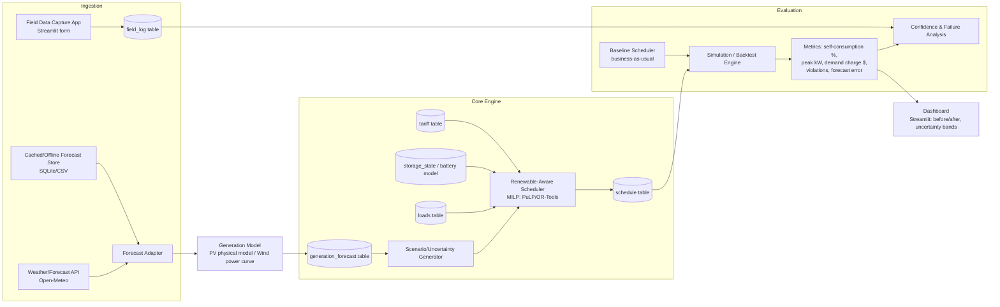

# System Architecture

The architecture decouples the **Ingestion & Forecast Engine**, the **Core Scheduling Engine**, and the **Simulation / Backtest Engine**.

## Modular Responsibilities

1. **Forecast Adapter (`forecast/adapter.py`)**:
   - Queries Open-Meteo hourly GHI, wind speeds (10m & 100m), temperature, and cloud cover.
   - Falls back gracefully: `live_api` -> SQLite `cache` -> `climatology_fallback`.

2. **Physical Generation Models (`forecast/generation_model.py`)**:
   - **PV Model**: Incorporates cell temperature derating ($T_{cell} = T_{amb} + \frac{GHI}{800}(NOCT-20)$) and panel degradation factors.
   - **Wind Power Curve**: Implements cubic power ramp between cut-in ($3.0$ m/s) and rated ($12.0$ m/s) wind speeds.

3. **Core MILP Scheduler (`scheduler/optimizer.py`)**:
   - Uses PuLP / CBC Mixed-Integer Linear Programming to co-optimize load shifting and battery charge/discharge over rolling horizons.

4. **Simulation & Backtest Engine (`sim/backtest_engine.py`)**:
   - Strictly decoupled from scheduler. Replays baseline and optimized schedules against ground truth `generation_actual` data to measure real-world performance defensively.
